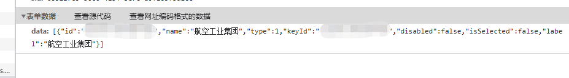

当http请求头如下时  'Content-Type': 'application/x-www-form-urlencoded; charset=UTF-8'
需要构造一种形如如下的数据结构 

需采用如下办法，利用 URLSearchParams 构造。
```angular2html
let param = [];
const formData = new FormData();
formData.append('data',JSON.stringify(params);
const body = new URLSearchParams(formData as any);
```