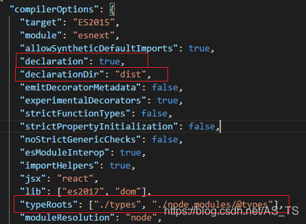

## Typescript 使用问题汇集

在使用typescript 时，会出现打包后生成编译成js文件，这导致从从typescript导出的模块、函数等无法使用

这时，我们需要配置 tsconfig.json 文件，在 typescript 官方文档中，编译选项，在这里找到与生成相应的 .d.ts 文件和 声明文件 相关的选项，其中包括：

- declaration
- declarationDir
- types
- typeRoots

